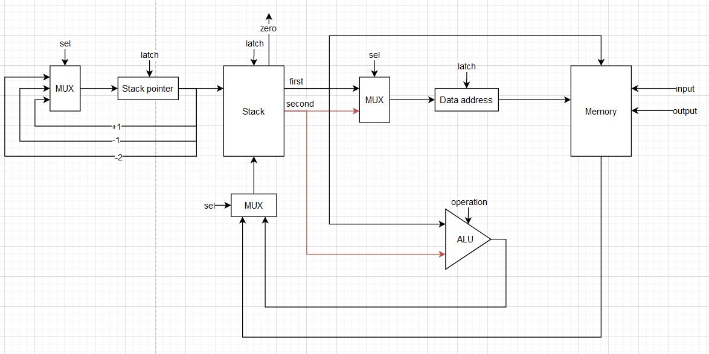
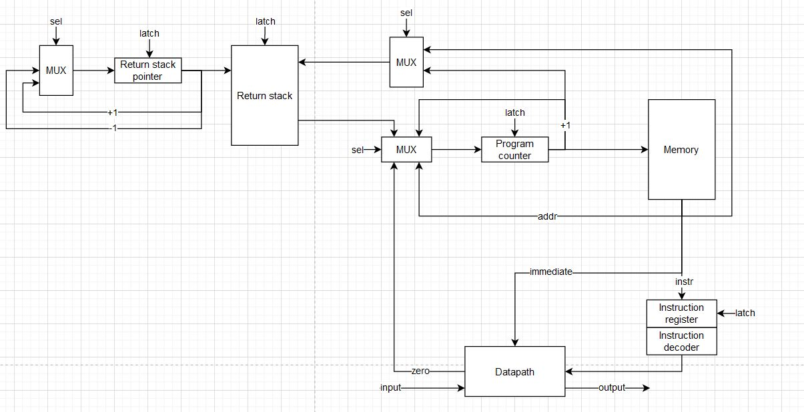

# Архитектура компьютера. Лабораторная работа 3

- Родионов Артем Алексеевич, P3221
- `lisp | stack | neum | hw | instr | binary | stream | mem | pstr | prob1 | cache`
- Базовый вариант

## Язык программирования
```ebnf
lisp ::= {data_alloc} {s_expr}

data_alloc ::= "(" alloc_str|alloc_num|alloc_buf ")"

alloc_str ::= "alloc_str" name string

alloc_num ::= "alloc_num" name number

alloc_buf ::= "alloc_buf" name number

s_expr ::= "(" name {s_expr} ")" [comment]
         | number
         | name
         | ""

comment ::= ";" {<any except "\n">}

number ::= ["-"] { <any of "0-9"> }

name ::= <any of "a-z A-Z _"> { <any of "a-z A-Z 0-9 _"> }

string ::= "\"" {<any except "\n" ";"> "\""} "\""
```

Стандартные функции
- `(get_val name)` - получить значение переменной по адресу
- `(get_by_addr name)` - получить значение переменной по адресу в переменной
- `(set name val)` - установить значение переменной по адресу
- `(while (cond) do (actions))` - цикл
- `(if (cond) then (actions) else (actions))` - оператор ветвления
- `(def_func name (actions))` - объявить пользовательскую функцию
- `(input addr)` - записать значение с ввода по адресу
- `(output val)` - вывести значение
- `(+ val val)` - сложение
- `(- val val)` - вычитание
- `(% val val)` - нахождение остатка
- `(= val val)` - сравнение
- `$1` - первый аргумент пользовательской функции

Особенности: 
- Любое выражение - `s_expression`
- Высокоуровневый язык, нет прямой работы с регистрами
- Код выполняется последовательно
- При трансляции все метки в коде заменяются на соответствующие адреса
- По умолчанию при чтении значения в стеке, оно удаляется
- Память выделяется и заполняется начальными значениями статически при запуске модели
- Видимость данных - глобальная
- Литералы:
  - Целое число
  - Строка

## Организация памяти
Модель памяти процессора:
- Архитектура фон Неймана - память данных и память команд объединены:
  - Машинное слово - 32 бита, знаковое
  - Линейное адресное пространство
  - Реализуется списком целых чисел
  - Одно число - одна инструкция или аргумент
- Адресация абсолютная (`JMP` `JZ` `CALL`)
- Стековая архитектура
- Для реализации подпрограмм присутствует стек возврата, в котором хранятся адреса следующих инструкций после возврата из подпрограммы и аргументы

Модель памяти:
- При запуске программы память выделяется статически
- Общая память для инструкций и данных
- У программиста нет прямого доступа к регистрам и стеку
- Система команд построена вокруг стека
- Стеки имеют собственную память для обеспечения их быстрой работы
- Можно осуществлять чтение и запись в память 
- Подпрограммы хранятся в памяти перед инструкциями
- Статические данные хранятся в памяти после инструкций. К динамическим данным можно отнести загруженные с помощью `PUSH`, которые хранятся на стеке или параметры функции с помощью `PUSHR`, которые хранятся в стеке возврата

```text
            Stack
+------------------------------+
| 00  : value                  |
|    ...                       |
| 10  : value                  | 
| 11  : undefined value        | <- stack pointer
|    ...                       |
+------------------------------+

             Memory
+------------------------------+
| 00  : subprogram instruction |
|    ...                       |
| 09  : RET                    |
| 10  : program start          |
| 11  : instruction            |
|    ...                       |
| 20  : CALL sub               |
|    ...                       |
|  n  : HLT                    |
| n+1 : value                  |
| n+2 : value                  |
|    ...                       |
| l+0 : string len             |
| l+1 : string value           |
|    ...                       |
| c+0 : buffer \0              |
| c+1 : buffer \0              |
|    ...                       |
+------------------------------+
```
- Литералы загружаются на стек с помощью `PUSH` или параметры функции с помощью `PUSHR`, которые хранятся в стеке возврата
- Литералы изначально находятся в статической памяти, если объявлены с помощью функций аллокации памяти
  - Порядок такой же как при объявлении
  - Данные хранятся после инструкций
- Строки хранятся по символу в машинном слове, перед строкой идет её длина
- Констант нет
- Инструкции могут быть подвержены изменениям, потому что лежат в одной памяти с данными
- Переход к следующей инструкции осуществляется
  - Последовательно
  - Безусловно - `CALL` `JMP` `RET`
  - Условно -`JZ`
- Процедуры 
  - Хранятся в памяти данных вместе с другими инструкциями
  - Начало определяется адресом, связанным с именем, к которому можно перейти с помощью `CALL`, при этом в стек возврата записывается адрес возврата
  - Конец - `RET`

## Система команд 
Особенности процессора
- Машинное слово - 32 бита, знаковое. Только абсолютная адресация
- Все данные представлены целым числом, поэтому с ними можно работать как с числом
- Регистры не доступны для программиста, но присутствуют специальные регистры
  - `Program counter` - хранит указатель на следующую инструкцию
    - Установка адреса осуществляется путём автоматического инкрементирования или с помощью команд управления потоком программы
  - `Instruction register` - хранит текущую инструкцию
  - `Stack pointer` - указатель на вершину стека
  - `Return stack pointer` - указатель на вершину стека возврата
  - `Data address` - указатель для доступа к данным
- Доступ к данным обычно осуществляется по адресу, хранящемуся в специальном регистре `Data address`
- Обработка данных:
  - Арифметические операции над значениями в стеке
  - Операции над стеком
- Ввод/вывод происходит связан с определенными ячейками в памяти
  - Порты реализованы с помощью списка чисел
- Поток управления:
  - Автоинкремент `Program counter`
  - Безусловный переход - `JMP` `CALL` `RET`
  - Условный переход - `JZ`, если на вершине стека ноль
  - `HLT` - остановка программы

### Набор инструкций
Все инструкции языка отображаются в последовательность инструкций процессора
- `(get_val name)` - `PUSH` + `GET_VAL`
- `(get_by_addr name)` - `PUSH` + `GET_VAL` + `GET_VAL`
- `(set name val)` - `PUSH` + `PUSH` + `GET_VAL` + `STORE_VAL`
- `(while (cond) do (actions))` - `JZ` + `JMP`
- `(if (cond) then (actions) else (actions))` - `JZ` + `JMP`
- `(def_func name (actions))` - `CALL` + `RET`
- `(input addr)` - `PUSH` + `PUSH` + `GET_VAL` + `STORE_VAL`
- `(output val)` - `PUSH` + `PUSH` + `GET_VAL` + `STORE_VAL`
- `(+ val val)` - `PUSH` + `PUSH` + `ADD`
- `(- val val)` - `PUSH` + `PUSH` + `SUB`
- `(% val val)` - `PUSH` + `PUSH` + `MOD`
- `(= val val)` - `PUSH` + `PUSH` + `EQ`
- `$1` - `PEEK`

Обозначения:
- M - memory
- DA - data address 
- PC - program counter
- Z - zero flag (на вершине стека ноль)
- RS - return stack
- RSP - return stack pointer
- SP - stack pointer
- TOS - top of stack
- SOS - second of stack

Все инструкции начинаются с выборки инструкции и увеличения `Program counter` (1 тик)

Инструкции управления потоком программы

| Инструкция    | Кол-во тактов | Описание                                    |
|---------------|:-------------:|---------------------------------------------|
| `HLT`         |       1       | Остановка программы                         |
| `JUMP` [addr] |       2       | PC = M[PC]                                  |
| `JZ` [addr]   |       2       | IF Z: PC = M[PC]                            |
| `CALL` [addr] |       3       | RPS = RPS + 1, RS[RSP] = PC + 1, PC = M[PC] |
| `RET`         |       2       | PC = RS[RSP], RSP = RSP - 1,                |

Инструкции работы со стеком

| Инструкция   | Кол-во тактов | Описание                                        |
|--------------|:-------------:|-------------------------------------------------|
| `GET_VAL`    |       3       | DA = TOS, TOS = M[DA]                           |
| `STORE_VAL`  |       3       | DA = SOS, M[DA] = TOS, SP = SP - 2              |
| `PEEK` [val] |       3       | SP = SP + 1, TOS = RS[RSP - M[PC]], PC = PC + 1 |
| `PUSH` [val] |       3       | SP = SP + 1, TOS = M[PC], PC = PC + 1           |
| `DROP`       |       2       | SP = SP - 1                                     |
| `PUSHR`      |       3       | RSP = RSP + 1, RS[RSP] = M[PC], PC = PC + 1     |
| `DROPR`      |       2       | RSP = RSP - 1                                   |

Инструкции арифметики

| Инструкция | Кол-во тактов | Описание                      |
|------------|:-------------:|-------------------------------|
| `ADD`      |       2       | SOS = SOS + TOS, SP = SP - 1  |
| `SUB`      |       2       | SOS = SOS - TOS, SP = SP - 1  |
| `MOD`      |       2       | SOS = SOS % TOS, SP = SP - 1  |
| `EQ`       |       2       | SOS = SOS == TOS, SP = SP - 1 |
| `OR`       |       2       | SOS = SOS or TOS, SP = SP - 1 |

### Кодирование инструкций
- Машинный код в бинарном формате
- Одна инструкция или аргумент - 32 бита
- Все инструкции данных заменяются на соответсвующие данные
- Вместо названий подставляется адрес в памяти

Пример:
```
00 - 0000000D - Opcode.PUSH
01 - 0000001C - Address: val
02 - 0000000D - Opcode.PUSH
03 - 00000000 - Number-value
04 - 0000000A - Opcode.GET_VAL
05 - 0000000B - Opcode.STORE_VAL
06 - 0000000D - Opcode.PUSH
07 - 0000001C - Address: val
08 - 0000000A - Opcode.GET_VAL
09 - 00000001 - Opcode.JZ
0A - 00000019 - Address: while_after0
0B - 0000000D - Opcode.PUSH
0C - 00000001 - Number-value
0D - 0000000D - Opcode.PUSH
0E - 0000001C - Address: val
0F - 0000000A - Opcode.GET_VAL
10 - 0000000B - Opcode.STORE_VAL
11 - 0000000D - Opcode.PUSH
12 - 0000001C - Address: val
13 - 0000000D - Opcode.PUSH
14 - 00000000 - Number-value
15 - 0000000A - Opcode.GET_VAL
16 - 0000000B - Opcode.STORE_VAL
17 - 00000000 - Opcode.JMP
18 - 00000006 - Number-value
19 - 00000004 - Opcode.HLT
```

В модуле [isa.py](./machine/isa.py) тип данных `Opcode` - перечисление кодов операций

В модуле [isa.py](./machine/isa.py) тип данных `ALU` - перечисление кодов операций АЛУ

В модуле [isa.py](./machine/isa.py) `MAP_INPUT_ADDRESS` и `MAP_OUTPUT_ADDRESS` - отображение на порты ввода/вывода

## Транслятор
Интерфейс командной строки:
```
usage: translator.py [-h] source_file target_file
                                                 
Трансляция кода                                  
                                                 
positional arguments:                            
  source_file  Имя файла с кодом                 
  target_file  Имя выходного файла

options:
  -h, --help   show this help message and exit 
```

Реализовано в модуле [translator.py](./translator.py)

Принципы работы:
- Пустые строки или только с комментариями пропускаются
- Комментарии в строках отсекаются
- Три прохода
  - Перевод в последовательность инструкций 
  - Подстановка адресов
  - Отображение в машинный код
- Также сохраняются мнемоники для инструкций в отдельный файл
- Проверяется, что числа в допустимом диапазоне
- Первым словом адрес начала программы
- В конце добавляется `HLT`
- Аллокация данных:
  - Замена на данные по типу данных
     - `alloc_num` - по значению
     - `alloc_str` - отрезаются кавычки, каждый символ = одно машинное слово + предшествующая длина строки
     - `alloc_buf` - заменяется на n `\0`
  - Сохранение адреса переменной для последующей замены обращений по имени
  - Адреса сдвигаются на длину части инструкций
- `.code`
  - Если токен начинается на `(` - вызов функции, добавляются предшествующие команды, сохраняется в стек для последующего добавления последовательности команд
  - Если токен заканчивается `)` - завершающая последовательность команд для обработки значений в стеке 
  - `output` и `input` - заменяется на команды чтения из памяти с подстановкой соответствующих адресов
  - Если токен начинается на `$` - обращение к параметру функции в стеке возврата
  - Если токен начинается на `@` - загрузка параметра функции в стек возврата
  - Остальные токены рассматриваются как имена переменных или значения

## Модель процессора
Интерфейс командной строки:
```
usage: simulation.py [-h] [--stack_size STACK_SIZE] [--debug_limit DEBUG_LIMIT] [--limit LIMIT] code_file [input_file]

Симуляция процессора

positional arguments:
  code_file             Имя файла бинарным с кодом
  input_file            Имя входного файла (опционально)

options:
  -h, --help            show this help message and exit
  --stack_size STACK_SIZE
                        Размер стека (по умолчанию 10)
  --debug_limit DEBUG_LIMIT
                        Лимит отладки (по умолчанию 200)
  --limit LIMIT         Лимит тиков (по умолчанию 100000)
```

Реализован в модуле: [simulation.py](./simulation.py)

Особенности работы модели:
- Стековая архитектура
- Подготовка и запуск модели происходит в методе `simulation` в модуле [simulation.py](./simulation.py)
- Шаг моделирования равен одной инструкции
- Для журнала состояний процессора используется стандартный модуль `logging`
  - Текущая инструкция
  - Состояние регистров
  - Вершина стека
  - Состояние стека и стека возврата
- Количество инструкций для моделирования и логирования лимитировано
- Остановка моделирования осуществляется при:
  - Превышении лимита количества выполняемых инструкций;
  - Исключении `EOFError` -- если нет данных для чтения из порта ввода;
  - Исключении `StopIteration` -- если выполнена инструкция `HLT`.


### DataPath


Реализован в классе `DataPath` в модуле [datapath.py](./machine/datapath.py)
- Сигналы приходят от `Control Unit`
- Сигналы реализованы в виде методов класса
- `Memory` - память: либо читаем, либо пишем
- `ALU` - АЛУ для выполнения арифметических операций
- `Stack` - стек
- `Stack pointer` - указатель на вершину стека
- `Data address` - указатель на данные
- `input`/`output` - порты ввода/вывода

Сигналы:
- `latch` - защёлкнуть соответствующий регистр
- `sel` - выбрать значение на соответсвующее мультиплексоре
- `operation` - выбор арифметической операции

Флаги:
- `zero` - для проверки вершины стека на ноль



Реализован в классе `ControlUnit` в модуле [control_unit.py](./machine/control_unit.py)   
- Сигналы приходят от `Instruction decoder`
- Сигналы реализованы в виде методов класса
- Цикл процессора реализован в методе `decode_and_execute_instruction`
  1. Выборка инструкции
  2. Инкремент `Program counter`
  3. Сигналы
  4. Увеличение тиков
- `Memory` - отсюда только читаем
- `Return stack` - стек возврата
- `Return stack pointer` - указатель на вершину стека возврата
- `Program counter` - указатель на следующую инструкцию
- `Instruction register` - хранит текущую инструкцию
- `Instruction decoder` - декодирует опкод операции
- `input`/`output` - порты ввода/вывода

Сигналы:
- `latch` - защёлкнуть соответствующий регистр
- `sel` - выбрать значение на соответсвующее мультиплексоре

## Тестирование
Тестирование выполняется при помощи golden test-ов

- Реализованные программы лежат в [code_files](./code_files)
- Предлагаемые входные данные лежат в [code_inputs](./code_inputs)
- Конфигурации golden test-ов лежат в [tests](./tests) в виде файлов формата _.yml_
  - Код программы
  - Входные данные
  - Мнемоники машинного кода
  - Машинный код 
  - Выходные данные
  - Журнал работы процессора

Алгоритмы:
  - [cat](./tests/cat.yml) - вывод потенциально бесконечных входных данных
  - [hello](./tests/hello.yml) - вывод сообщения
  - [hello_user](./tests/hello_user.yml) - вывод приветствия пользователя с учетов ввода
  - [prob1](./tests/prob1.yml) - алгоритм на работу с числами

Запустить тесты: `poetry run pytest . -v`

Обновить конфигурацию golden tests: `poetry run pytest . -v --update-goldens`

Разбор теста `cat` ([cat](./tests/cat.yml))
- Код программы
```text
; init memory               ; комментарий
(alloc_num val 0)           ; аллокация памяти под переменную `val`

; transfer output to input  ; комментарий
(input val)                 ; чтение значения с ввода в переменную `val`
(while (get_val val) do     ; цикл пока в `val` не 0
    (output (get_val val))  ; вывод значения из `val`
    (input val)             ; чтение значения с ввода в переменную `val`
)                           ; конец цикла
```
- Вывод транслятора
```
python .\translator.py .\code_files\cat.lisp .\code_out\cat.o
LoC: 9 Instr: 30 Code bytes: 120
```
- Мнемоники
```
00 - 0000000D - Opcode.PUSH
01 - 0000001C - Address: val
02 - 0000000D - Opcode.PUSH
03 - 00000000 - Number-value
04 - 0000000A - Opcode.GET_VAL
05 - 0000000B - Opcode.STORE_VAL
06 - 0000000D - Opcode.PUSH
07 - 0000001C - Address: val
08 - 0000000A - Opcode.GET_VAL
09 - 00000001 - Opcode.JZ
0A - 00000019 - Address: while_after0
0B - 0000000D - Opcode.PUSH
0C - 00000001 - Number-value
0D - 0000000D - Opcode.PUSH
0E - 0000001C - Address: val
0F - 0000000A - Opcode.GET_VAL
10 - 0000000B - Opcode.STORE_VAL
11 - 0000000D - Opcode.PUSH
12 - 0000001C - Address: val
13 - 0000000D - Opcode.PUSH
14 - 00000000 - Number-value
15 - 0000000A - Opcode.GET_VAL
16 - 0000000B - Opcode.STORE_VAL
17 - 00000000 - Opcode.JMP
18 - 00000006 - Number-value
19 - 00000004 - Opcode.HLT
```
- Вывод процессора (логирование уровня INFO)
```
python .\simulation.py .\code_out\cat.o .\code_inputs\text.txt
INFO:root:Start simulation
INFO:root:output_buffer: bla-bla
INFO:root:End simulation
bla-bla
Instructions: 92 Ticks: 259
```
- Журнал работы, логирование уровня DEBUG (часть)
```
python .\simulation.py .\code_out\cat.out .\code_inputs\text.txt   
INFO:root:Start simulation
DEBUG:root:TICK:    0 [ 0: PUSH      ] PC:   0 RSP: -1 TOS:  -1 DA:   0 SP: -1 STACK: [-1, -1, -1, -1, -1] RSTACK: [-1, -1, -1, -1, -1] 
DEBUG:root:TICK:    3 [ 2: PUSH      ] PC:   2 RSP: -1 TOS:  28 DA:   0 SP:  0 STACK: [28, -1, -1, -1, -1] RSTACK: [-1, -1, -1, -1, -1] 
DEBUG:root:TICK:    6 [ 4: GET_VAL   ] PC:   4 RSP: -1 TOS:   0 DA:   0 SP:  1 STACK: [28, 0, -1, -1, -1] RSTACK: [-1, -1, -1, -1, -1] 
DEBUG:root:input: b
DEBUG:root:TICK:    9 [ 5: STORE_VAL ] PC:   5 RSP: -1 TOS:  98 DA:   0 SP:  1 STACK: [28, 98, -1, -1, -1] RSTACK: [-1, -1, -1, -1, -1] 
DEBUG:root:TICK:   12 [ 6: PUSH      ] PC:   6 RSP: -1 TOS:  -1 DA:  28 SP: -1 STACK: [28, 98, -1, -1, -1] RSTACK: [-1, -1, -1, -1, -1] 
DEBUG:root:TICK:   15 [ 8: GET_VAL   ] PC:   8 RSP: -1 TOS:  28 DA:  28 SP:  0 STACK: [28, 98, -1, -1, -1] RSTACK: [-1, -1, -1, -1, -1] 
DEBUG:root:TICK:   18 [ 9: JZ        ] PC:   9 RSP: -1 TOS:  98 DA:  28 SP:  0 STACK: [98, 98, -1, -1, -1] RSTACK: [-1, -1, -1, -1, -1] 
DEBUG:root:TICK:   20 [11: PUSH      ] PC:  11 RSP: -1 TOS:  -1 DA:  28 SP: -1 STACK: [98, 98, -1, -1, -1] RSTACK: [-1, -1, -1, -1, -1] 
DEBUG:root:TICK:   23 [13: PUSH      ] PC:  13 RSP: -1 TOS:   1 DA:  28 SP:  0 STACK: [1, 98, -1, -1, -1] RSTACK: [-1, -1, -1, -1, -1] 
DEBUG:root:TICK:   26 [15: GET_VAL   ] PC:  15 RSP: -1 TOS:  28 DA:  28 SP:  1 STACK: [1, 28, -1, -1, -1] RSTACK: [-1, -1, -1, -1, -1] 
DEBUG:root:TICK:   29 [16: STORE_VAL ] PC:  16 RSP: -1 TOS:  98 DA:  28 SP:  1 STACK: [1, 98, -1, -1, -1] RSTACK: [-1, -1, -1, -1, -1] 
DEBUG:root:output: b << b
DEBUG:root:TICK:   32 [17: PUSH      ] PC:  17 RSP: -1 TOS:  -1 DA:   1 SP: -1 STACK: [1, 98, -1, -1, -1] RSTACK: [-1, -1, -1, -1, -1]
DEBUG:root:TICK:   35 [19: PUSH      ] PC:  19 RSP: -1 TOS:  28 DA:   1 SP:  0 STACK: [28, 98, -1, -1, -1] RSTACK: [-1, -1, -1, -1, -1]
DEBUG:root:TICK:   38 [21: GET_VAL   ] PC:  21 RSP: -1 TOS:   0 DA:   1 SP:  1 STACK: [28, 0, -1, -1, -1] RSTACK: [-1, -1, -1, -1, -1]
DEBUG:root:input: l
DEBUG:root:TICK:   41 [22: STORE_VAL ] PC:  22 RSP: -1 TOS:  108 DA:   0 SP:  1 STACK: [28, 108, -1, -1, -1] RSTACK: [-1, -1, -1, -1, -1]
DEBUG:root:TICK:   44 [23: JMP       ] PC:  23 RSP: -1 TOS:  -1 DA:  28 SP: -1 STACK: [28, 108, -1, -1, -1] RSTACK: [-1, -1, -1, -1, -1]
DEBUG:root:TICK:   46 [ 6: PUSH      ] PC:   6 RSP: -1 TOS:  -1 DA:  28 SP: -1 STACK: [28, 108, -1, -1, -1] RSTACK: [-1, -1, -1, -1, -1]
DEBUG:root:TICK:   49 [ 8: GET_VAL   ] PC:   8 RSP: -1 TOS:  28 DA:  28 SP:  0 STACK: [28, 108, -1, -1, -1] RSTACK: [-1, -1, -1, -1, -1]
DEBUG:root:TICK:   52 [ 9: JZ        ] PC:   9 RSP: -1 TOS:  108 DA:  28 SP:  0 STACK: [108, 108, -1, -1, -1] RSTACK: [-1, -1, -1, -1, -1]
```

### CI
CI при помощи Github Action

[python.yml](./.github/workflows/python.yml)
- `poetry` - управления зависимостями для языка программирования Python.
- `coverage` - формирование отчёта об уровне покрытия исходного кода.
- `pytest` - утилита для запуска тестов.
- `ruff` - утилита для форматирования и проверки стиля кодирования.

Запускается при пуше в репозиторий на ветку мастер
Тестовые процессы
- `test` - запуск тестов
- `lint` - запуск линтера

### Для сбора аналитики

| ФИО                        | алг             | LoC | code байт | code инстр. | инстр. | такт. | вариант                                                                    |
|:---------------------------|:----------------|:----|:----------|:------------|:-------|:------|:---------------------------------------------------------------------------|
| Родионов Артем Алексеевич  | cat             | 9   | 120       | 30          | 92     | 259   | `lisp - stack - neum - hw - instr - binary - stream - mem - pstr - prob1`  |
| Родионов Артем Алексеевич  | hello           | 14  | 256       | 64          | 285    | 800   | `lisp - stack - neum - hw - instr - binary - stream - mem - pstr - prob1`  |
| Родионов Артем Алексеевич  | hello_user_name | 36  | 640       | 160         | 517    | 1458  | `lisp - stack - neum - hw - instr - binary - stream - mem - pstr - prob1`  |
